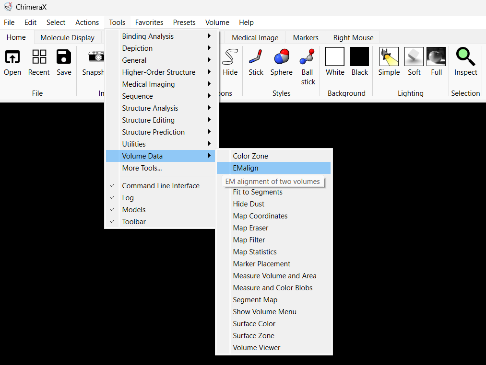

# EMalign - ChimeraX Bundle

EMalign is an algorithm for aligning maps with respect to rotation, reflection, and translation.

This bundle is deigned to be installed as a plugin to ChimeraX program.

Note that the algorithm is aimed to align two maps of the same structure (for example, two half maps), and not to fit a small structure into a larger one.
The two maps can have different dimensions and pixel size, but should represent similar structures.

You can also install the plugin through the ChimeraX toolshed at https://cxtoolshed.rbvi.ucsf.edu/apps/chimeraxemalign

<h2>Install EMalign</h2>
<h3>Install EMalign from source code:</h3>

* Download the emalign4chimerax folder and save it in the designated directory (PATH=emalign4chimerax folder).
* Open ChimeraX and run the following commands in the command line bar at the bottom of the screen:
   
```
   devel build PATH\emalign
   devel install PATH\emalign
   devel clean PATH\emalign
```

* Restart ChimeraX, then the EMalign tool should appear in the toolbar:


   


<h2>User Guide</h2>
1. Opening the EMalign tool:

Open ChimeraX and navigate to the 'Volume' menu. Select the EMalign tool from the list.


2. Selecting maps:

In the EMalign tool window, select the reference map and the query map from the dropdown menus.


3. Setting alignment parameters:

Set the parameters for alignment, such as rotation, translation, and reflection options.

Adjust these settings as needed for your specific use case.


4. Running the alignment:

Click the 'Align' button to start the alignment process. 

The tool will automatically handle the alignment and provide a progress log when finished.


5. Viewing the aligned maps:

Once the alignment is complete, you can view the aligned maps directly in ChimeraX. 

The aligned maps will be displayed, and you can further analyze or manipulate them as needed.


